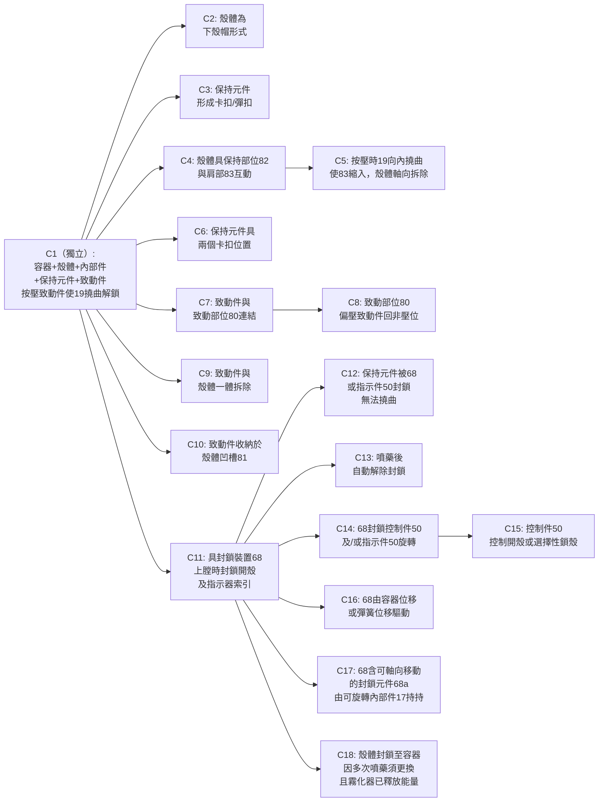

# 專利結構化分析報告: US11642476B2
# NEBULIZER

---

## 基本資料

| 欄位 | 內容 |
|:---|:---|
| **專利號** | US 11,642,476 B2 |
| **標題** | Nebulizer |
| **發明人** | Beueler, Birgit (DE); Brieger, Frank (DE); Hin, Benedikt (DE); Hoffmann, Dennis (DE) 等 |
| **權利人** | Boehringer Ingelheim International GmbH, Ingelheim am Rhein (DE) |
| **申請號** | 17/132,843 |
| **申請日** | 2020年12月19日（本次 continuation） |
| **核准日** | 2023年5月9日 |
| **優先權** | EP 13003987.8（2013年8月9日）；最早美國申請：14/453,805（2014年8月7日） |
| **國際分類** | A61M 15/00 (2006.01)；A61M 11/00 (2006.01) |
| **美國分類** | CPC A61M 15/0081；A61M 11/00；A61M 15/0001；A61M 15/0028 等 |
| **主審委員** | Joseph D. Boecker |
| **權利要求數** | 18 項（1 項獨立項） |
| **圖式頁數** | 21 張（含 2 張 Prior Art） |
| **被引次數** | 844 次（本數據集中最高） |
| **專利狀態** | **有效中**，到期日估算：2034年8月7日（詳見第 6 節） |

---

## 1. 專利摘要 (Patent Abstract)

本發明解決的核心問題是：霧化器（nebulizer）在帶壓/上膛狀態（tensioned/loaded state）下，用戶可能誤開殼體更換容器，造成流體洩漏或劑量計數錯誤。先前技術（FIG. 1-2，Boehringer Ingelheim 自家平台）雖允許下殼體拆卸，但缺乏針對上膛狀態的主動封鎖機制。

本發明的核心在於一個**兩件式鎖扣/釋放機構**：保持元件（retaining element, 19）與內部件（inner part, 17）永久連結並不可拆，下殼體（housing part, 18）靠保持元件卡扣固定；另設獨立的手壓致動件（actuator member, 79），按壓時使保持元件彈性變形，讓殼體可以拆除。此設計確保致動件與殼體一體被移除，每次換殼必須主動按壓。

進一步，本發明增加了**封鎖裝置（blocking device, 68）**：當霧化器處於上膛狀態時，自動封鎖保持元件使其無法被致動件變形（即封鎖開殼動作），待藥液噴出後（非上膛狀態）才解鎖，防止帶壓開殼。

---

## 2. 核心技術圖示 (Key Figures)

> 本節選取 4 張直接對應 Claim 1 必要元素的圖式。完整圖式存於 `US11642476B2_figures/`。

### 核心圖 1 — FIG. 3：發明主體縱截面（整體架構）

*FIG. 3 為本發明霧化器（1）的全截面總覽，展示 Claim 1 的全部必要元素：容器（3）、下殼體（18）、內部件（17）、保持元件（19，位於 17b 段）、輸送機構（6, 7）。對比 FIG. 1-2 先前技術，FIG. 3 新增了保持元件 19 與致動件 79 的分離式設計，以及底部的封鎖裝置架構。*

### 核心圖 2 — FIG. 4：鎖扣機構詳圖（Claim 1 核心）

*FIG. 4 展示保持元件（19）與下殼體（18）的卡扣關係，以及保持肩部（83）的幾何形態——對應 Claim 3「形成卡扣或彈扣」、Claim 4「保持部位（82）與保持肩部（83）互動」、Claim 5「致動時 19 向內撓曲使 83 縮入，殼體得以軸向拆除」的具體實施。*

### 核心圖 3 — FIG. 9：保持元件 + 致動件組合（Claim 7, 9, 10）

*FIG. 9（Sheet 9 of 21）顯示致動件（79）收納於殼體凹槽（81），致動件與殼體（18）一同拆卸時的位置關係，對應 Claim 9「致動件與殼體一體拆除」及 Claim 10「致動件容納於殼體凹槽（81）」。組件 55、43、44、45 為計數顯示器相關組件。*

### 核心圖 4 — FIG. 16：封鎖裝置細節（Claim 11–18）

*FIG. 16（Sheet 13 of 21）展示封鎖裝置（68）的完整結構：封鎖元件（68a）由內部件（17）軸向可動地持持、連動旋轉控制件（50）及指示器（71）。當霧化器上膛時，68a 軸向移動至封鎖位置，阻止保持元件 19 變形，防止殼體誤開。對應 Claim 11, 14, 16, 17 的具體限定。*

---

## 3. 權利要求層次結構 (Claim Tree)

---

## 4. 關鍵術語定義 (Glossary)

| 術語 (Term) | 專利內定義 | 來源段落 |
|:---|:---|:---|
| **Nebulizer（霧化器）** | 用於霧化流體並以氣溶膠形式輸送的手持醫療裝置，以彈簧驅動加壓噴嘴霧化，不使用推進氣體 | Abstract, Background |
| **Container（容器, 3）** | 裝有待霧化流體的可替換剛性容器，內含柔性藥囊（inner bag） | Background, Claim 1 |
| **Housing part（殼體/下殼體, 18）** | 可從霧化器拆卸的帽狀下殼體，用於更換容器；拆除時連同致動件 79 一起移除 | Claim 1, Claim 9 |
| **Inner part（內部件, 17）** | 霧化器的固定主體結構，保持元件 19 永久連結於此，可旋轉（17 is rotatable） | Claim 1, Claim 17 |
| **Retaining element（保持元件, 19）** | 與內部件 17 連結且不可拆的彈性卡扣件，在未按壓狀態下自動保持殼體 18；被 68 封鎖時無法撓曲 | Claim 1, Claim 12 |
| **Actuator member（致動件, 79）** | 獨立於保持元件 19 的手壓件，按壓時使 19 彈性撓曲，允許殼體拆除 | Claim 1 |
| **Retaining shoulder（保持肩部, 83）** | 保持元件 19 上的突出肩部，在卡扣位置勾住殼體 18 的保持部位 82 | Claim 4, Claim 5 |
| **Blocking device（封鎖裝置, 68）** | 在霧化器上膛（tensioned）狀態時，自動封鎖保持元件 19 使其無法被致動件 79 撓曲的機構 | Claim 11 |
| **Tensioned state（上膛狀態）** | 霧化器彈簧已蓄能、壓縮腔已充液、可立即噴藥的就緒狀態（loaded state / ready-to-discharge state） | Claim 11, Description |
| **Comprising（開放性連接詞）** | 開放性用語，表示「包含但不限於」，申請專利範圍的結構允許包含未列舉之額外元件 | Claim 1 |
| **Indicator member（指示件, 50）** | 顯示數字（52）及/或符號（53）的計數顯示器；在上膛狀態被 68 封鎖旋轉 | Claims 11–15 |
| **Elastically deform / flex（彈性變形/撓曲）** | 保持元件 19 在按壓致動件時所發生的可回復形變，非永久塑性變形 | Claim 1 |

---

## 5. 技術組件清單 (Structured Components)

| 組件編號 | 名稱 | 必要性 | 技術特徵與對標價值 |
|:---|:---|:---|:---|
| **1** | 霧化器 (Nebulizer) | 必要 | 系統整體，不使用推進氣體的彈簧驅動霧化裝置 |
| **2** | 流體 (Fluid) | 必要 | 待霧化藥液，儲存於容器 3 的內袋 |
| **3** | 容器 (Container) | 必要 | 可替換剛性容器，含藥液內袋；多次噴藥後需整體更換 |
| **4** | 底座/刺穿件 (Base/Piercing element) | 選用 | 容器初次安裝時刺穿密封的底部構件（見 FIG. 4） |
| **5** | 噴嘴/出口 (Nozzle) | 選用 | 高壓流體霧化輸出口 |
| **6** | 輸送管 (Delivery tube) | 選用 | 彈簧釋放時壓入壓縮腔的流體輸送元件 |
| **7** | 驅動彈簧 (Drive spring) | 選用 | 蓄能元件；上膛後釋放驅動流體加壓 |
| **17** | 內部件 (Inner part) | 必要 | 可旋轉的固定主體，保持元件 19 永久連結於此 |
| **17a/17b** | 內部件上/下段 | 選用 | 分段結構（見 FIG. 3），17b 段持持保持元件 19 |
| **18** | 下殼體 (Housing part / Cap) | 必要 | 帽狀可拆式下殼，拆除時同時帶走致動件 79 |
| **19** | 保持元件 (Retaining element) | 必要 | 彈性卡扣件；不可與 17 拆分；撓曲時允許 18 拆除 |
| **21** | 殼體底部件 | 選用 | 殼體底端封蓋（見 FIG. 3） |
| **22** | 底部開口/通氣孔 | 選用 | 容器底部通氣（見 FIG. 3-4） |
| **50** | 控制件/指示器 (Indicator member) | 選用 | 旋轉計數顯示器，顯示數字 52 / 符號 53；被 68 封鎖 |
| **52/53** | 計數數字/符號 | 選用 | 指示器顯示的剩餘劑量數字與符號 |
| **68** | 封鎖裝置 (Blocking device) | 選用 | 上膛狀態時自動封鎖 19 及 50 的複合機構 |
| **68a** | 封鎖元件 (Blocking element) | 選用 | 由 17 軸向可動持持的封鎖滑塊；上膛時移入封鎖位置 |
| **68b–68g** | 封鎖裝置子件 | 選用 | 封鎖裝置的彈片、齒形、止擋等子件（見 FIG. 16） |
| **79** | 致動件 (Actuator member) | 必要 | 手壓件，獨立於 19，按壓使 19 撓曲；隨殼體 18 一體拆除 |
| **80** | 致動部位 (Actuator portion) | 選用 | 持持致動件 79 並提供回復偏壓的彈臂 |
| **81** | 殼體凹槽 (Housing recess) | 選用 | 收納致動件 79 的凹槽，位於殼體 18 上 |
| **82** | 保持部位 (Holding portion) | 選用 | 殼體 18 上與保持肩部 83 互動的對接結構 |
| **83** | 保持肩部 (Retaining shoulder) | 選用 | 保持元件 19 的突出肩部；致動時縮入讓殼體通過 |

---

## 6. FTO / 迴避設計建議

### 地雷分析（Literal Infringement 風險點）

| 獨立項 | 核心元素組合 | 覆蓋範圍說明 |
|:---|:---|:---|
| **Claim 1（獨立）** | ① 容器（3）＋ ② 可拆下殼體（18）＋ ③ 內部件（17）＋ ④ 保持元件（19）**永久連結於 17 且不可拆** ＋ ⑤ 輸送機構 ＋ ⑥ **獨立**手壓致動件（79）**作用於 19** ＋ ⑦ 按壓 79 使 19 **彈性撓曲**以允許 18 拆除 | 覆蓋所有「以獨立手壓件使保持元件彈性形變以解鎖殼體」的霧化器設計。「comprising」為開放語言，產品可有額外組件不影響侵權判斷。核心風險元素為 ④⑥⑦ 的組合：19 與 17 永久連結 ＋ 79 獨立於 19 ＋ 靠彈性撓曲解鎖。 |

### 路徑建議（Design-around 技術）

| 策略 | 具體技術手段 | 可規避之限定 |
|:---|:---|:---|
| **A. 合併保持與致動功能** | 使用單一元件同時作為保持件與釋放件（即按壓同一元件直接解扣），消除「致動件為保持元件之獨立分離件」的結構 | Claim 1 第⑥項：「actuator member which is a **separate part** from the retaining element」 |
| **B. 剛性平移解鎖（非彈性形變）** | 以剛性滑動楔塊（rigid sliding wedge）推移保持件，保持件整體滑動而非彈性撓曲；保持件本身不發生彈性形變 | Claim 1 第⑦項：「elastically deform or **flex** the retaining element」 |
| **C. 殼體可帶走保持元件** | 設計保持元件（19）可隨殼體（18）一起被拆除（使 19 非永久連結於 17）；用磁吸或摩擦卡合取代永久固定 | Claim 1 第④項：「retaining element **connected with and not detachable from** the inner part」 |
| **D. 電子/感測解鎖** | 以電子感測按鈕觸發馬達或電磁鐵釋放殼體鎖，不使用機械手壓致動件作用於保持元件 | Claim 1 第⑥項：「**manually depressible** actuator member」整體結構 |

> **建議優先考慮策略 A 或 B**，因其規避的是 Claim 1 的結構性核心限定，法律上較確定；策略 C 可能被主張均等論（doctrine of equivalents），風險較高。

### 專利狀態（重要）

> **有效中**
>
> - 本次申請日（continuation）：2020年12月19日
> - 最早美國非暫時案申請日：**2014年8月7日**（14/453,805）
> - 申請日 ≥ 1995年6月8日 → **新法（20年自最早申請日）**
> - 到期日：2014年8月7日 ＋ 20年 ＝ **2034年8月7日**（±PTA 調整）
>
> **本專利目前有效，效期至 2034年8月7日前後。實施相關技術前請諮詢專利律師。**

---

## 附錄：引用文獻

**優先美國專利文獻（Prior Related US Patents）：**
- US 10,004,857 B2（2018）Beueler et al. — 本案母案（14/453,805）
- 其餘引用文獻數量龐大（844 件被引），見 PDF 封面頁 2–8

**優先外國文獻：**
- EP 13003987.8（2013年8月9日）— 最早優先權申請，Boehringer Ingelheim

**其他文獻（Other Publications）：**
- Niven et al., "Some Factors Associated with the Ultrasonic Nebulization of Proteins", *Pharmaceutical Research*, vol. 12, No. 1, 1995, pp. 53-59
- Remington Pharmacy, 19th ed., Spanish Secondary Edition, 1995, Sciarra, Chapter 95, R97-1185
- Trasch et al., "Performance data of refloquart Glucose...", *Clinical Chemistry*, vol. 30, 1984, p. 969
- Wall et al., "High levels of exopeptidase activity...", *International Journal of Pharmaceutics*, vol. 97, 1993, pp. 171-181
- Wang et al., "Self-Assembled Silane Monolayers", *Langmuir*, 2005, vol. 21, No. 5, pp. 1846-1857

---

*分析日期：2026年6月14日 | 依 /patent-structured-analysis v3.0 框架產出*
*文字來源：Google Patents 詳情頁（web scrape）；圖式來源：USPTO PDF（掃描版，已提取為 PNG）*
